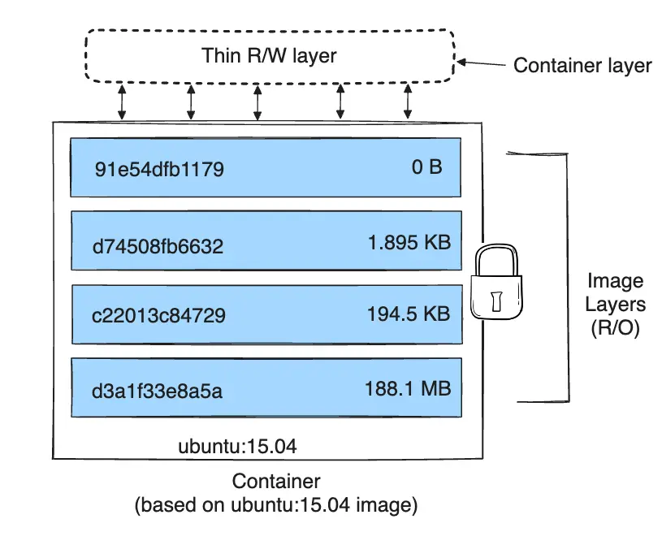

A Docker image is built up from a series of layers. Each layer represents an instruction in the image's Dockerfile. The layers are "stacked on top" of each other. Consider the following Dockerfile:

```dockerfile
# syntax=docker/dockerfile:1
FROM ubuntu:22.04
LABEL org.opencontainers.image.authors="org@example.com"
COPY . /app
RUN make /app
RUN rm -r $HOME/.cache
CMD python /app/app.py
```

This Dockerfile contains four commands which create new layers and two which don't. Commands that modify the filesystem create a new layer. 
1. The `FROM` statement starts out by ***creating a layer*** from the ubuntu:22.04 image. 
1. The `LABEL` command only modifies the image's metadata, and doesn't produce a new layer. 
1. The `COPY` command adds some files from your Docker client's current directory. This command ***creates a new layer***.
1. The first `RUN` command builds your application using the make command, and writes the result to a ***new layer***. 
1. The second `RUN` command removes a cache directory, and writes the result to a ***new layer***. 
1. Finally, the `CMD` instruction specifies what command to run within the container, which only modifies the image's metadata, which doesn't produce an image layer.

Each layer is only a set of differences from the layer before it. Note that both *adding*, and *removing* files will result in a new layer. In the example above, the `$HOME/.cache` directory is removed, but will still be available in the previous layer and add up to the image's total size.

## Containers

Each layer is read-only, *except the very last one*. When you create a new container, you add a new writable layer on top of the underlying layers. The last layer is often called the "container layer". All changes made to the running container, such as writing new files, modifying existing files, and deleting files, are written to this thin writable container layer. 

The diagram below shows a container based on an `ubuntu:15.04` image:



The major difference between a container and an image is the top writable layer. All writes to the container that add new or modify existing data are stored in this writable layer. When the container is deleted, the writable layer is also deleted. The underlying image remains unchanged.
Because each container has its own writable container layer, and all changes are stored in this container layer, multiple containers can share access to the same underlying image and yet have their own data state.

## Copy-on-Write (CoW) Strategy

Copy-on-write is a strategy of sharing and copying files for maximum efficiency. If a file or directory exists in a lower layer within the image, and another layer (including the writable layer) needs *only read access* to it, it just uses the existing file. The first time another layer needs to modify the file (when building the image or running the container), the file is copied into that layer and modified. This minimizes I/O and the size of each of the subsequent layers. 

### CoW with overlay2

When an existing file in a container is modified, the storage driver performs a copy-on-write operation. The specific steps involved depend on the specific storage driver. For the `overlay2` driver, the copy-on-write operation follows this rough sequence:
- Search through the image layers for the file to update. The process starts at the newest layer and works down to the base layer one layer at a time. When results are found, they're added to a cache to speed future operations.
- Perform a `copy_up` operation on the first copy of the file that's found, to copy the file to the container's writable layer.
- Any modifications are made to this copy of the file, and the container can't see the read-only copy of the file that exists in the lower layer.
Note that changing the metadata of files, for example, changing file permissions or ownership of a file, can also result in a `copy_up` operation.

A `copy_up` operation can incur a noticeable performance overhead. This overhead is different depending on which storage driver is in use. Large files, lots of layers, and deep directory trees can make the impact more noticeable. This is mitigated by the fact that each copy_up operation only occurs the first time a given file is modified.

# References
- https://docs.docker.com/engine/storage/drivers/#storage-drivers-versus-docker-volumes
