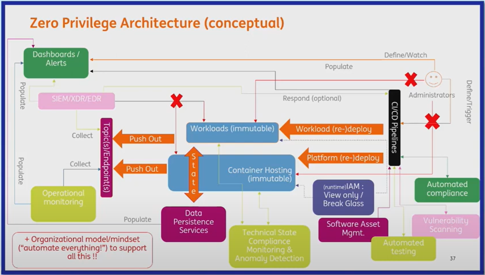

# Videos

*Schedule (North America): https://kccncna2023.sched.com/* 
*Schedule (Europe): https://kccnceu2023.sched.com/*

## Tutorial: Getting Familiar with Security Observability Using eBPF & Cilium Tetragon - Holmes & Cooley
*YouTube: https://www.youtube.com/watch?v=kTGU-Nc2Db0*

- [Isovalent Tetragon Lab](https://isovalent.com/labs/tetragon-getting-started/)
- Seccomp policies are applied to an application before it starts. Any updates to the policy requires application restart to get applied.
- Since Tetragon uses eBPF the policy can change dynamically.

## Eraser: Cleaning up Vulnerable Images from Kubernetes Nodes - Peter Engelbert & Ashna Mehrotra
*YouTube: https://www.youtube.com/watch?v=LjDzn7qI5SE*

- [GitHub - eraser-dev/eraser](https://github.com/eraser-dev/eraser)
- [Documentation](https://eraser-dev.github.io/eraser/docs/quick-start)
- Ashna Mehrotra - asmehrotra@microsoft.com
- Peter Engelbert - pengelbert@microsoft.com
- Existing K8s garbage-collection runs only when there is disk-pressure. Default threshold is 85% and it stops at 80%.
- Why is it not enabled for Windows nodes?
- One pod per node - Can be run manually or on schedule.
- Each pod has three containers: collector, scanner, remover. They communicate through shared filesystem and named pipes.

## Journey Through Time: Understanding Etcd Revisions and Resource Versions in Kubernetes - Priyanka Saggu
*YouTube: https://www.youtube.com/watch?v=i7RCoEjAMOo*

- etcd - A distributed, reliable key-value store for the critical data in a distributed system.
- etcd revisions are snapshots of the object state in the KV-store.
- Revisions are stored as KV-pair themselves. Key is the revision/sub-revision and value is the data being modified.
- Each CRUD op on a KV-pair updates the revision number on etcd. Also the same revision number is saved to the KV-pair being modified.
- Deletion adds a 'tombstone' to the KV-pair. Value is still present, but not returned when queried.
- etcd compaction removes tombstoned revisions.
- etcd Keys for K8s information is a path: '/registry/<obj-type>/<namespace>' e.g. '/registry/deployments/default'.
- etcd (mod_revision) == K8s object (ResourceVersion). mod_revision is always incrementing with the etcd revision, so it's unique across deletions.
- Further watching: [Leipzig Gophers #19: A Journey into the Kubernetes ListerWatcher Rabbit Hole
](https://www.youtube.com/watch?v=Z9fwIzy0C_8)

## Running Not Root Made Easy - Luboslav Pivarc, Red Hat
*YouTube: https://www.youtube.com/watch?v=3Ic1w-jAaQY*

- kubevirt - Run VMs inside Pods as regular workloads.
- root in container is root on the host.
- K8s doesn't support user namespaces?
- Access control is baked into container images.
- Map volume mounts to required folder paths for the container, rather than give it access to the host file-system. However, mounting an existing path will result in data being overwritten.
- [dive](https://github.com/wagoodman/dive) helps you analyze the filesystem for any container image.
- DOCKERFILE RUN creates a new layer.
- Adding capability to K8s YAML does not work out of box. We need to explicitly request the Kernel to give it.

## Zero Privilege Architectures - Thijs Ebbers & Diana Iordan, ING
*YouTube: https://www.youtube.com/watch?v=CPh5RsSv8cI*

- Runtime workloads are immutable.
- CI/CD pipelines are the only way to deploy changes. CI/CD pipelines need to be efficient and fast.
- Breakglass a/c to be configured only for select few.
- [27th Feb, 2023 - CISA Director Jen Easterly Lecture and Fireside Chat](https://www.cisa.gov/securebydesign/dir-easterly-remarks-carnegie-mellon-university)
    - [Video](https://www.kaltura.com/index.php/extwidget/preview/partner_id/2612992/uiconf_id/49325582/entry_id/1_s80j6o80/embed/dynamic)
- 